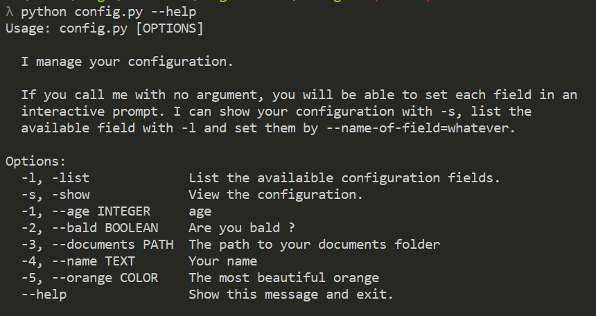

# configlib

A bit desperate by the lack of good and easy to use configuration libraries in python, 
I decided to write this one. The two main goals are:
- Make it easy for the you to describe the data you use to configurate your project and be able 
to save and load it in one line
- Make it easy for the user of your code to modify his configuration through the command line

### Installation

    pip install pyconfiglib

## User interface

The end user can easily see his configuration with

    python config.py --show

That will print in colors (if availaible) his config:

He is able to see what are all the fields easily with

    python config.py --list
    

He can change each field in an interactive prompt, for the whole configuration 
or only a sub configuration by one of the following. 
He can also directly set one field via the command line:

    python config.py
    python config.py colors.castle
    python config.py age=42
    python config.py colors.walls.east=#ffaa77

## Developper interface

### Simple configuration

#### Fields

To create a configuration for you project, just create a new subclass of `Config`.
All the class attributes defined here are called _fields_. 
A field is a name associated with a data. The fields are what will be saved/stored in you configuration file.

Example:

    import configlib
    
    class Config(configlib.Config):
    
        name = 'John'
        surname = 'Jo'
        age = 42

**NOTE:** fields names can not start nor end with an underscore (`_`), 
so we can have attributes not tracked by the config.

**NOTE:** no field can be set to a callable object. 
This is a deliberate choice to allow defining functions in the class' body.

#### Types

The fields are typed so you don't have to verify that a configuration is valid when you load it.
If the data of a field is `int`, `float`, `str` or `bool`, you do not have to precise the type of the field.

You can precise a type by adding a `__[FIELD-NAME]_type__ = ...` class attribute.

If you want an other type, there are two options:
- You want an other builtin type, like `list`, `dict` or `tuple`, then you need to precise the type you want:
     
        class Config(configlib.Config):
            ...
        
            pet_names = ['didi', 'bibi', 'lili']
            __pet_names_type__ = configlib.Python(dict)

   However:
    - you don't have to, but this adds the possibility for the user to enter the value he wants when prompted.
    - The value is evaluated with python's `eval` function, so the user can run any code. 
    This is potentially dangerous, even if you trust your users.
    - If you want a `dict` and know the `dict`'s keys, it is better to use a `SubConfig` instead.

 - You want a custom type or just restrict some values. If so you need to create a new `ConfigType` subclass. 
 
##### Custom Types

_In the following, `MyType` designate your custom type, `StoredType` and is that you stores in the json which is one of 
 `bool`, `int`, `float`, `list`, `dict` or  `str` (those are the only types json supports). Usually it will be `str` (`or list`)_

Say that you want only positives intergers for the age. You can create a `PositiveIntegerType`.   

A subclass of `ConfigType` must define 4 things:
 - a `name`. This the name of the type, who is supposed to be more gentle than the class name, it will be 
    shown to the user.
 - a `load(value: Union[StoredType, str]) -> MyType` method. This method will be called when loading the configuration, 
    from the json file and on user input. This must raise a `ValueError` when you can't load the value.
 - and a `save(value: MyType) -> StoredType` method. This is used to convert from your type to something json can handle
    when the configuration is saved.
 - an `is_valid(value: MyType) -> bool` method. This is used every times the field is set, and should return True is 
    the given value is a valid data for the field. Usually, it can just be `return isinstance(value, MyType)`
    

###### Example
    
    class PositiveIntegerType(configlib.ConfigType):
        
        name = natural number
        
        def load(value):
            if isianstance(value, str):
                value = int(value)
                
            if not isinstance(value, int):
                raise ValueError('Not an integer')
                
            if value > 0:
                return value
            else:
                raise ValueError('Not positive')
                
        def save(value):
            return value
            
        def isvalid(value):
            return isinstance(value, int) and value > 0
    
And then in your `Config` class add:

    class Config(configlib.Config):
        ...
        
        __age_type__ = PositiveIntegerType()

**NOTE:** Don't forget to instantiate `ConfigType`.

#### Hints

You can also add hints, that will be displayed when the user is prompted for a field or when the list is displayed.
Hints are specified in the same way as the types, by adding a `__[FIELD-NAME]_hint__` class attribute.

Example:

    class Config(configlib.Config):
        ...

        __age_hint__ = 'Your age in days'

#### Printing

You can pretty print the configuration with `__show__`. 
This will print the config and to add colors is pygments is installed.

Alternatively, you can just `str()` the config to get a human readable string, 
without any color. `repr()` returns the same string but in only one line.

### Sub-Configurations
*Documentation needs to be done*

### Other important stuff

#### Save emplacement

To define where a configuration is saved, set the value of `__config_path__` to the path you want. 
It is better to to specify absolute path relative to the current `__file__` like this one:

    __config_path__ = os.path.join(os.path.dirname(__file__), '.config')

Because the current directory may not be the one of your code, because a script can be called from everywhere.

#### Version checking

If you make breaking changes to the configuration so that loading the current saved config would crash 
your program (a common example is when you have a list that needs to be of a specific size, and this
size changed), you can automatically load the default config by setting the `__version__`.

If the saved `__version__` and the `__version__` defined in your code do not match, 
the config will be reset. 
There is actually no support to "upgrade" the config instead, 
but you can probably do it manually depending on the issue you're facing.

#### Allow user interface

At the end of your config's file, you can add: 

    if __name__ == '__main__':
        configlib.update_config(Config)

So running `python config.py [OPTIONS]` will trigger the command line interface described in the first part.

#### Saving configs in non-editable format

Often, one wants to prevent his users from editing the configuration manually, 
for instance in a multiplayer game where they could just give themselves a 999 damage weapon...
Pyconfiglib let you crypt simply the configuration with `__xor_key__`. This performs a simple xor
between the key and the config to save. It is enough to keep most people from manually editing the config,
but wont stop the 1% of people that you do anything to edit this damn connfig. Anyway, there's nothing you 
can do against them, except storing everything in your server. (and even there they could send the 
right requests...)

Anyway, if `__xor_key__` is set to anything else than `b''`, the default, the config will be xor-crypted
with that given key. `__xor_key__` should be a byte string, and the bigger the better.

You can override `__crypt__` and `__decrypt__` to use a different encryption algorithm. 
They both take a single parameter, a byte string, and should return this byte string (en|de)crypted.